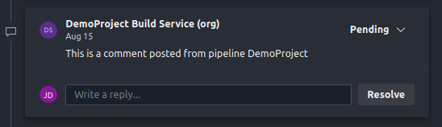
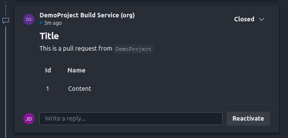

# Pull Request Comments

---

**Add comments to a pull request**

---

## Options

### Example

```yaml
- task: PullRequestComments@0
  inputs:
    action: create #Action to perform
    skipIfCommentExists: true #If the comment exists on the pull request, do not post it again
    commentId: #Is used to uniqely identify the comment when using the same task multiple times in the same pipeline
    status: Active #Post the comment with a given status
    content: #The content of the comment. For Markdown syntax, see [Syntax guidance for basic Markdown usage](http://go.microsoft.com/fwlink/?LinkId=823918)
    useDefined: false #If set, overrides the value from `System.PullRequest.PullRequestId`
    pullRequestId: $(System.PullRequest.PullRequestId) #If no id is given, the value from `System.PullRequest.PullRequestId` is taken. If a value is given, this overrides the value from `System.PullRequest.PullRequestId`
    type: Text #The type of comment. `Text` represents a regular user comment while `System` indicates a system message

```

### All Options

| Option                | Default Value                         | Required | Help                                                                                                                                                                 | Options                                           |
| :-------------------- | :------------------------------------ | :------: | :------------------------------------------------------------------------------------------------------------------------------------------------------------------- | :------------------------------------------------ |
| `action`              | `create`                              |    ❌    | Action to perform                                                                                                                                                    | `create`, `createOrUpdate`, `update`              |
| `skipIfCommentExists` | `true`                                |    ❌    | If the comment exists on the pull request, do not post it again                                                                                                      | --                                                |
| `commentId`           | --                                    |    ❌    | Is used to uniqely identify the comment when using the same task multiple times in the same pipeline                                                                 | --                                                |
| `status`              | `Active`                              |    ❌    | Post the comment with a given status                                                                                                                                 | `Active`, `Fixed`, `WontFix`, `Closed`, `Pending` |
| `content`             | --                                    |    ✅    | The content of the comment. For Markdown syntax, see [Syntax guidance for basic Markdown usage](http://go.microsoft.com/fwlink/?LinkId=823918)                       | --                                                |
| `useDefined`          | `false`                               |    ❌    | If set, overrides the value from `System.PullRequest.PullRequestId`                                                                                                  | --                                                |
| `pullRequestId`       | `$(System.PullRequest.PullRequestId)` |    ❌    | If no id is given, the value from `System.PullRequest.PullRequestId` is taken. If a value is given, this overrides the value from `System.PullRequest.PullRequestId` | --                                                |
| `type`                | `Text`                                |    ❌    | The type of comment. `Text` represents a regular user comment while `System` indicates a system message                                                              | `Text`, `System`                                  |


## Examples

## Posting a comment

Given the following pipeline configuration

```yaml
steps:
  - task: PullRequestComments@0
    displayName: 'Post a pull request comment'
    inputs:
      content: 'This is a comment posted from pipeline $(Build.Repository.Name)'
      status: 'Pending'
      action: 'create'
```

after a run against a pull request it will post the comment:




## Posting a comment with markdown

Given the following pipeline configuration

```yaml
steps:
  - task: PullRequestComments@0
    inputs:
      status: 'Closed'
      action: 'create'
      content: |
        #Title

        This is a pull request from `$(Build.DefinitionName)`

        | Id  | Name    |
        | --- | ------- |
        | 1   | Content |
```

after a run against a pull request it will post the comment:




## Posting multiple comments

When posting multiple comments, ensure `commentId` is set to a unique value for each task.

```yaml
steps:
  - task: PullRequestComments@0
    displayName: 'Post regular comment'
    inputs:
      action: 'createOrUpdate'
      status: 'Closed'
      commentId: 'regular_comment'
      content: |
        #Title

        This is a pull request from `$(Build.DefinitionName)`

        | Id  | Name    |
        | --- | ------- |
        | 1   | Content |
  - task: PullRequestComments@0
    displayName: 'Post markdown comment'
    inputs:
      action: 'createOrUpdate'
      status: 'Pending'
      commentId: 'markdown_comment'
      content: 'This is a comment posted from pipeline $(Build.Repository.Name)'
```

